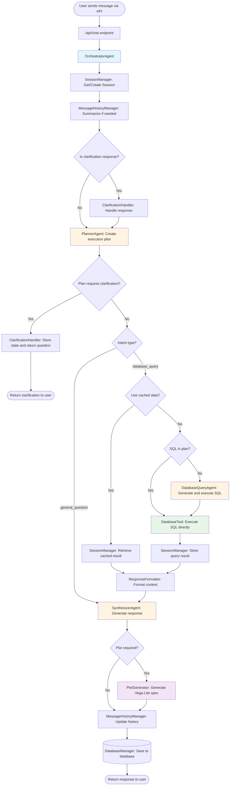

# DAAgent - Multi-Agent Database Assistant

A multi-agent system for answering database queries and general questions using a coordinated pipeline of specialized agents.

## Architecture Overview

The system uses a multi-agent orchestration pattern where specialized agents work together to process user queries. The main flow involves planning, execution, and synthesis stages.

## System Flow Diagram

## Components

### Agents

#### OrchestratorAgent
**Location**: `app/agents/orchestrator.py`

**Purpose**: Main coordinator that orchestrates the entire agent pipeline.

**When Used**: Every user request flows through the OrchestratorAgent, which coordinates all other agents and utilities.

**Key Responsibilities**:
- Manages the complete request lifecycle
- Coordinates PlannerAgent, DatabaseQueryAgent, and SynthesizerAgent
- Handles session state and message history
- Manages clarification flow
- Caches query results for reuse
- Integrates with MLflow for tracing

#### PlannerAgent
**Location**: `app/agents/planner_agent.py`

**Purpose**: Creates structured execution plans that determine intent, plot requirements, and data source decisions.

**When Used**: First agent in the pipeline for every user request (unless handling a clarification response).

**Key Responsibilities**:
- Classifies intent (database_query vs general_question)
- Determines if clarification is needed
- Decides whether to use cached data or fetch new data
- Specifies plot requirements (type, columns)
- Optionally generates SQL query if intent is database_query

**Output**: `ExecutionPlan` model containing intent, clarification needs, plot requirements, and data source decisions.

#### DatabaseQueryAgent
**Location**: `app/agents/database_query_agent.py`

**Purpose**: Generates SQL queries and executes them against the database.

**When Used**: When the execution plan indicates a database_query intent and cached data should not be used (or is unavailable).

**Key Responsibilities**:
- Generates appropriate SQL queries based on user questions
- Uses DatabaseTool to execute queries
- Returns structured QueryAgentOutput with SQL, results, and explanation

**Tools Used**: 
- `query_database` tool (wraps DatabaseTool)

**Output**: `QueryAgentOutput` model with SQL query, execution results, and explanation.

#### SynthesizerAgent
**Location**: `app/agents/synthesizer_agent.py`

**Purpose**: Creates clear, natural language responses from agent outputs or user questions.

**When Used**: Final agent in the pipeline, always called to generate the user-facing response.

**Key Responsibilities**:
- Synthesizes responses from database query results or general questions
- Decides if plots are needed (if not already specified in plan)
- Coordinates with PlotGenerator to create visualizations
- Formats responses in a user-friendly way

**Output**: `AgentResponse` model with message, metadata, and optional plot specification.

#### SummarizerAgent
**Location**: `app/agents/orchestrator.py` (initialized in OrchestratorAgent)

**Purpose**: Summarizes long conversation history to manage context window limits.

**When Used**: Automatically by MessageHistoryManager when message history exceeds threshold (20 messages).

**Key Responsibilities**:
- Summarizes old messages while preserving recent context
- Maintains conversation continuity without losing important context

### Tools

#### DatabaseTool
**Location**: `app/tools/db_tool.py`

**Purpose**: Executes SQL queries against the SQLite database with typed inputs and outputs.

**When Used**: 
- Directly by OrchestratorAgent when SQL is provided in the execution plan
- Indirectly by DatabaseQueryAgent via the `query_database` tool

**Key Responsibilities**:
- Executes SQL queries safely
- Returns typed DatabaseResult objects
- Handles errors gracefully
- Connects to SQLite database (default: `db/iris_data.db`)

**Input**: `DatabaseQuery` model with SQL query and optional parameters

**Output**: `DatabaseResult` model with success status, data rows, error information, and row count.

### Utilities

#### SessionManager
**Location**: `app/utils/session_manager.py`

**Purpose**: Manages session state including message history and cached query results.

**When Used**: 
- At the start of every request to get/create session
- When storing/retrieving cached query results
- When resetting session state

**Key Responsibilities**:
- Maintains session state per session_id
- Stores and retrieves cached query results
- Manages message history per session
- Cleans up old cached results (keeps last 5)

#### MessageHistoryManager
**Location**: `app/utils/message_history.py`

**Purpose**: Manages conversation history, including summarization when history grows too large.

**When Used**: 
- At the start of every request to summarize history if needed
- After generating response to update history

**Key Responsibilities**:
- Summarizes message history when it exceeds 20 messages
- Preserves recent 10 messages while summarizing older ones
- Adds new messages to session history
- Uses SummarizerAgent for summarization

#### Router
**Location**: `app/utils/routing.py`

**Purpose**: Handles intent-based routing to appropriate agents.

**When Used**: By OrchestratorAgent to route database queries to DatabaseQueryAgent.

**Key Responsibilities**:
- Routes database queries to DatabaseQueryAgent
- Provides MLflow tracing for routing operations

#### ClarificationHandler
**Location**: `app/utils/clarification_handler.py`

**Purpose**: Manages the clarification flow when user questions are ambiguous.

**When Used**: 
- When checking if current message is a clarification response
- When execution plan indicates clarification is needed
- When handling user's response to clarification

**Key Responsibilities**:
- Detects if message is a clarification response
- Stores pending clarification state
- Combines original question with clarification response
- Returns clarification questions to users

#### ResponseFormatter
**Location**: `app/utils/response_formatter.py`

**Purpose**: Formats agent outputs into context strings for the SynthesizerAgent.

**When Used**: Before calling SynthesizerAgent to prepare formatted context.

**Key Responsibilities**:
- Formats database query results for synthesizer input
- Includes query information, results summary, and metadata
- Handles both database queries and general questions
- Indicates if cached data or plots are being used

#### PlotGenerator
**Location**: `app/utils/plot_generator.py`

**Purpose**: Generates Vega-Lite plot specifications using Altair.

**When Used**: By SynthesizerAgent when a plot is required (specified in execution plan or determined by synthesizer).

**Key Responsibilities**:
- Generates Vega-Lite JSON specifications
- Supports multiple plot types: bar, line, scatter, histogram
- Infers appropriate plot configurations from data
- Handles data type detection and column selection

**Output**: Vega-Lite JSON specification dictionary.

#### TraceManager
**Location**: `app/utils/tracing.py`

**Purpose**: Manages MLflow tracing for observability.

**When Used**: Throughout the request lifecycle to tag traces with metadata.

**Key Responsibilities**:
- Tags MLflow traces with session and user information
- Tags intent types for analysis
- Provides observability into agent behavior

#### PromptRegistry
**Location**: `app/core/prompt_registry.py`

**Purpose**: Manages prompt templates from MLflow with fallback support.

**When Used**: During OrchestratorAgent initialization to load prompts for all agents.

**Key Responsibilities**:
- Loads prompts from MLflow prompt registry
- Falls back to hardcoded prompts if MLflow unavailable
- Injects database pack information into prompts
- Manages prompt versions

#### DatabasePackLoader
**Location**: `app/core/pack_loader.py`

**Purpose**: Loads database schema information from YAML files.

**When Used**: During OrchestratorAgent initialization to load database metadata.

**Key Responsibilities**:
- Loads database pack from YAML files
- Provides schema information to agents via prompts
- Describes tables, columns, and example queries

## Execution Flow

### Step-by-Step Process

1. **User Request Received**
   - FastAPI `/api/chat` endpoint receives user message
   - Creates `UserMessage` with content, session_id, and username
   - Loads conversation history from database

2. **Session Management**
   - `SessionManager` gets or creates session state
   - `MessageHistoryManager` checks if history needs summarization
   - If history > 20 messages, summarizes old messages (keeps last 10)

3. **Clarification Check**
   - `ClarificationHandler` checks if current message is a response to pending clarification
   - If yes, combines original question with clarification response
   - If no, proceeds to planning

4. **Planning Phase**
   - `PlannerAgent` creates `ExecutionPlan`:
     - Classifies intent (database_query or general_question)
     - Determines if clarification is needed
     - Decides plot requirements
     - Chooses cached data vs new query
     - Optionally generates SQL query

5. **Clarification Handling** (if needed)
   - If plan requires clarification:
     - `ClarificationHandler` stores pending clarification state
     - Returns clarification question to user
     - Flow stops here, waiting for user response

6. **Plan Execution**
   - For `database_query` intent:
     - If `use_cached_data=True`: `SessionManager` retrieves cached result
     - If `use_cached_data=False`:
       - If SQL in plan: `DatabaseTool` executes SQL directly
       - If no SQL: `Router` routes to `DatabaseQueryAgent` to generate and execute SQL
     - Query results stored in session cache
   - For `general_question` intent: Skip to synthesis

7. **Response Formatting**
   - `ResponseFormatter` formats context for `SynthesizerAgent`:
     - Includes user question
     - Includes query results (if database query)
     - Indicates cached data usage
     - Indicates plot requirements

8. **Synthesis Phase**
   - `SynthesizerAgent` generates final response:
     - Synthesizes natural language from context
     - Determines plot needs (if not in plan)
     - Coordinates with `PlotGenerator` if plot required

9. **Plot Generation** (if required)
   - `PlotGenerator` creates Vega-Lite specification:
     - Converts data to DataFrame
     - Generates appropriate plot type (bar, line, scatter, histogram)
     - Returns JSON specification

10. **History Update**
    - `MessageHistoryManager` adds user message and assistant response to history
    - History stored in session state

11. **Database Persistence**
    - `DatabaseManager` saves chat message to database
    - Stores message, response, intent_type, and metadata (including plot_spec)

12. **Response Return**
    - Returns `ChatResponse` to user with:
      - Response message
      - Intent type
      - Metadata
      - Plot specification (if generated)

## Data Models

### Key Models

- **UserMessage**: User input with content, session_id, username
- **ExecutionPlan**: Plan created by PlannerAgent with intent, clarification needs, plot requirements, data source decisions
- **QueryAgentOutput**: Output from DatabaseQueryAgent with SQL query, results, and explanation
- **AgentResponse**: Final response with message, metadata, and optional plot specification
- **DatabaseQuery**: SQL query with optional parameters
- **DatabaseResult**: Query execution result with success status, data, error information
- **PlotSpec**: Vega-Lite specification with plot type

## Configuration

The system uses configuration from `app/core/config.py`:
- Default model for agents
- Summarizer model for history summarization
- MLflow experiment name
- Database paths

## Database Schema

The system uses SQLite databases:
- `db/app.db`: Application database for users, sessions, and chat history
- `db/iris_data.db`: Data database for query execution (default)

## API Endpoints

- `POST /api/auth/login`: Authenticate user and get JWT token
- `POST /api/chat`: Send chat message and get response
- `GET /api/chat/history`: Get chat history for current user
- `POST /api/chat/reset`: Reset chat history for current user
- `GET /api/health`: Health check endpoint

