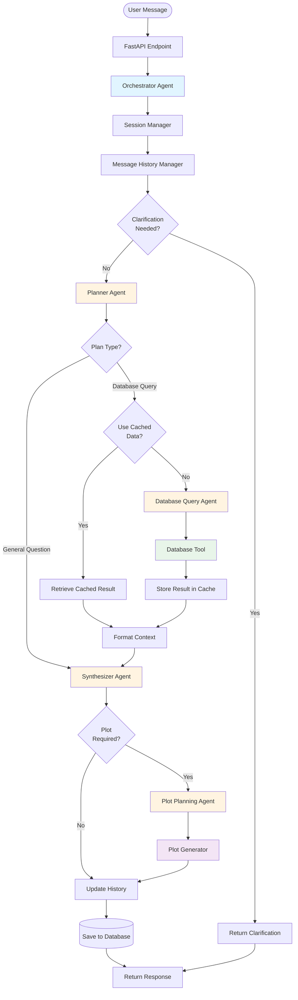

# DAAgent - Multi-Agent Database Assistant

A multi-agent system for answering database queries and general questions using a coordinated pipeline of specialized agents.

## Overview

DAAgent is a conversational AI assistant that can answer questions about your database and generate visualizations. It uses a multi-agent orchestration pattern where specialized agents work together to:

- Understand user intent and plan execution
- Generate and execute SQL queries
- Synthesize natural language responses
- Create data visualizations when appropriate

## System Architecture

The system follows a multi-agent orchestration pattern with the following flow:



## Quickstart Guide

### Prerequisites

- Python 3.13+
- Node.js and npm
- `uv` package manager (for Python)
- Environment variables configured (see Configuration section)

### Setup Steps

1. **Install Python dependencies:**
   ```bash
   uv sync
   ```

2. **Install frontend dependencies:**
   ```bash
   cd frontend
   npm install
   cd ..
   ```

3. **Register initial prompts:**
   ```bash
   uv run scripts/register_prompts.py
   ```

4. **Generate sample data:**
   ```bash
   uv run db/generate_data.py --all
   ```

### Running the Application

Start the application in the following order:

1. **Start MLflow server** (for tracing and prompt management):
   ```bash
   uv run mlflow server
   ```
   MLflow UI will be available at `http://localhost:5000`

2. **Start the backend API:**
   ```bash
   uv run uvicorn app.api.main:app --reload --host 0.0.0.0 --port 8000
   ```
   API will be available at `http://localhost:8000`

3. **Start the frontend:**
   ```bash
   cd frontend
   npm run dev
   ```
   Frontend will be available at `http://localhost:3000`

### Alternative: Using the server entry point

You can also start the backend using the server entry point:
```bash
uv run python app/api/server.py
```

## Configuration

The system requires environment variables for model configuration. Create a `.env` file in the project root with:

- `SMALL_MODEL_AZURE_NAME`: Azure model name
- `SMALL_MODEL_AZURE_ENDPOINT`: Azure endpoint URL
- `SMALL_MODEL_AZURE_API_VERSION`: Azure API version
- `SMALL_MODEL_AZURE_API_KEY`: Azure API key
- `MLFLOW_EXPERIMENT_NAME`: (Optional) MLflow experiment name

## Key Components

### Agents

- **Orchestrator Agent**: Coordinates the entire pipeline
- **Planner Agent**: Creates execution plans and determines intent
- **Database Query Agent**: Generates and executes SQL queries
- **Synthesizer Agent**: Creates natural language responses
- **Plot Planning Agent**: Determines optimal plot configurations

### Tools & Utilities

- **Database Tool**: Executes SQL queries safely
- **Schema Tool**: Provides database schema information via progressive disclosure
- **Session Manager**: Manages conversation state and cached results
- **Message History Manager**: Handles conversation history and summarization
- **Plot Generator**: Creates Vega-Lite visualizations
- **Clarification Handler**: Manages clarification flow for ambiguous queries

## API Endpoints

- `POST /api/auth/login`: Authenticate and get JWT token
- `POST /api/chat`: Send chat message and get response
- `GET /api/chat/history`: Get chat history for a session
- `POST /api/chat/reset`: Reset chat history
- `POST /api/chat/sessions`: Create a new chat session
- `GET /api/chat/sessions`: Get all chat sessions
- `POST /api/chat/cancel`: Cancel an active request
- `GET /api/health`: Health check

## Development Notes

This application is designed for development use. Production deployment would require:

- PostgreSQL database
- Enhanced authentication and authorization
- CI/CD pipeline
- Docker containerization
- Comprehensive monitoring and logging
- Row-level security policies

## Project Structure

```
DAAgent/
├── app/                    # Main application code
│   ├── agents/            # Agent implementations
│   ├── api/               # FastAPI endpoints
│   ├── core/              # Core configuration and models
│   ├── db/                # Database management
│   ├── tools/             # Agent tools
│   └── utils/             # Utility functions
├── db/                    # Database files and data loaders
├── frontend/              # Next.js frontend application
├── scripts/               # Utility scripts
└── test/                  # Test files
```
